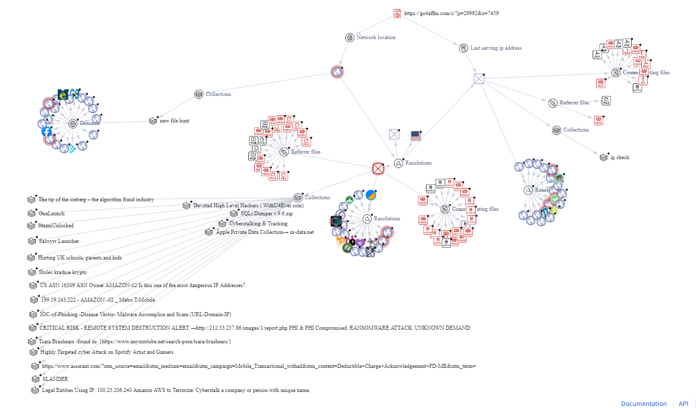

This was one of my first captures on VirusTotal. I came across this link while job hunting. The job posting sounded too good to be true: an entry-level position that sounded easy with high pay and the ability to work from home. I copied and pasted the link attached to the posting’s “apply” button into VirusTotal. Sure enough, several security vendors responded by saying the link is malicious.
   Now that I understood the link was malicious, I was curious as to why. This is where I took advantage of VirusTotal’s graphing function to map out what was going on behind this URL. I have provided a picture of the capture. Our malicious domain in question is the “go4affm.com”. Attached to it are two unauthorized IP addresses listening in, one from the Netherlands, and one from Russia. Our two foreign friends have quite the nasty surprise planned as both have software suites that are loaded with trojans. Moreover, they also have a suite of scareware containing fake system virus alerts and ransomware alerts, most likely meant to scare the victim into doing something irrational.
Attached to the URL, of course, is its associated domain. This too is poisoned as it contains malicious scripts and links itself to several other malicious domains. Overall, I’ve concluded the objective of this attack is to get the victim to believe that an incredibly good job opportunity has arisen. They will then click the link and, if their antivirus and security controls are either lacking or non-existent, their computer will be flooded with trojans to track and steal information and scareware meant to scare the victim into doing something irrational like downloading a fake antivirus.
This one link sparked my interest in this little hobby as it made me have a burning desire to figure out how these links work and how I can make sure they do not hurt anyone.

  

